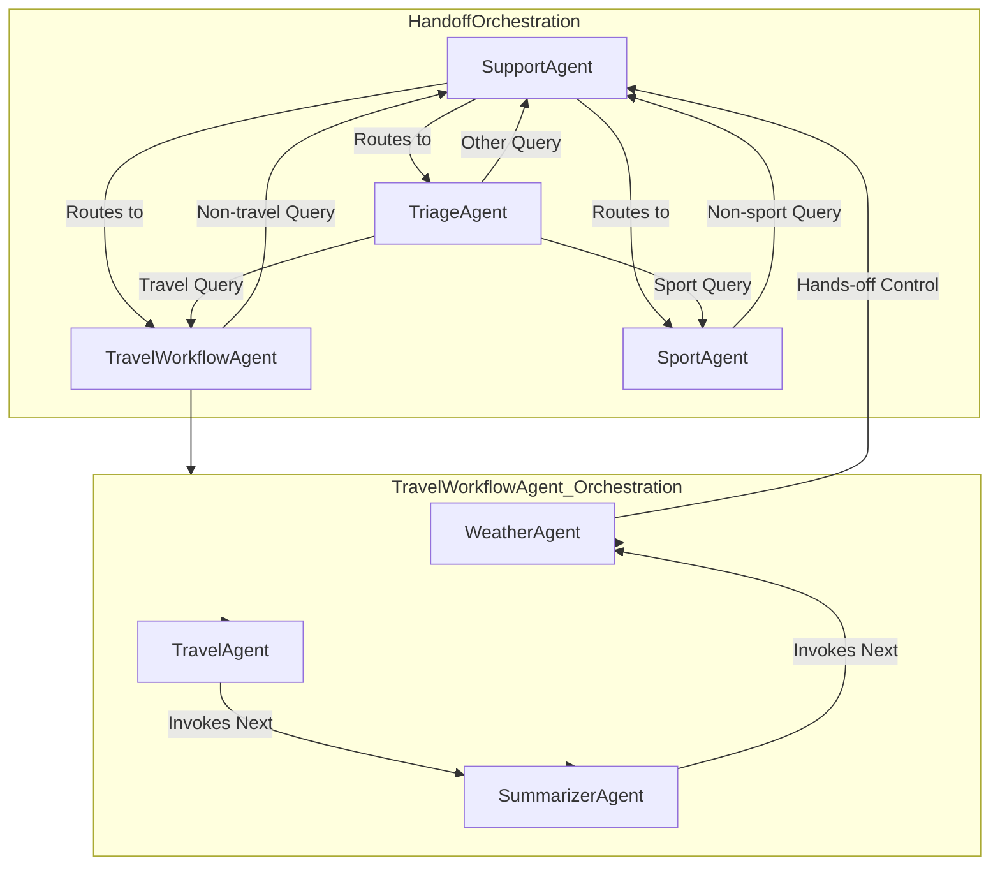

# Multi-Agentic AI Agents with Microsoft Semantic Kernel

There are 3 Python scripts that represent 3 different implementations of multi-agents powere by an Agentic AI Framework (Semantic Kernel) Each script represents an evolution in the agentic-based design. The script on top is the most evolved.

---

## 1. Agentic with Embedded Orchestrations

The script *agentic_embed_orch.py* implements a multi-agent system using the Semantic Kernel library, specifically focusing on orchestration patterns: **Sequential Orchestration** and **Handoff Orchestration**. Here's an architecture-like analysis:

---

### 1.1 Core Components

#### 1.1.1 Agents (`ChatCompletionAgent`)

These are the fundamental building blocks. Each agent is an instance of `ChatCompletionAgent`, which utilizes a language model (Azure OpenAI in this case) to process instructions and generate responses. Agents are given a name and instructions that define their role and behavior.

#### 1.1.2 Kernel

Each agent is associated with a `Kernel` instance. The kernel is responsible for managing services (like the AI service) and potentially skills/plugins (though not explicitly used for skills in this example).

#### 1.1.3 Services (`AzureChatCompletion`)

This represents the connection to the underlying AI model (Azure OpenAI). Agents use a service to send prompts and receive completions.

#### 1.1.4 Runtime (`InProcessRuntime`)

The runtime is responsible for executing the agent's tasks and managing the flow of messages within the orchestration.

---

### 1.2 Orchestration Patterns

The script demonstrates two main orchestration patterns:

#### 1.2.1 Sequential Orchestration

- **Purpose**: To process a task by passing it through a sequence of agents. Each agent in the sequence performs a specific step.
- **Implementation**: The `SequentialOrchestration` class is used within the `TravelWorkflowAgent`.

#### 1.2.2 Agents involved (`get_sequential_agents`)
- **TravelAgent**: Provides general travel advice.
- **SummarizerAgent**: Summarizes the output of the previous agent.
- **WeatherAgent**: Provides weather information.

#### 1.2.3 Flow
A task given to the `TravelWorkflowAgent` is first processed by the `TravelAgent`, then its output is passed to the `SummarizerAgent`, and finally to the `WeatherAgent`. The final response is the combined result of this sequence.

---

### 1.3 Handoff Orchestration

- **Purpose**: To route a user query to the appropriate agent based on the user's intent. If an agent cannot handle the request or determines another agent is more suitable, it can "handoff" the conversation to that agent.
- **Implementation**: The `HandoffOrchestration` class is used in the `run_handoff_orchestration` function.

#### 1.3.1 Agents involved (`get_handoff_agents`)
- **SupportAgent**: Acts as the initial point of contact and a fallback agent.
- **TriageAgent**: Analyzes user intent and routes the query.
- **TravelWorkflowAgent**: Handles travel-related queries (this agent itself uses Sequential Orchestration internally).
- **SportAgent**: Handles sport-related queries.

#### 1.3.2 Handoffs (`OrchestrationHandoffs`)
This defines the allowed transitions between agents. For example, the `SupportAgent` can handoff to the `TriageAgent`, `TravelWorkflowAgent`, or `SportAgent`.

#### 1.3.3 Flow
The orchestration starts with the `SupportAgent`. Based on the initial task or subsequent user input, the `SupportAgent` might handoff to the `TriageAgent` to determine the user's intent. The `TriageAgent` then hands off the query to the appropriate specialized agent (`TravelWorkflowAgent` or `SportAgent`). If none of the specialized agents can handle the request, they can handoff back to the `SupportAgent` with an explanation.

---

### 1.4 Observer Functions

- **`agent_response_callback`**: This function is used to observe and print the messages generated by the agents during the orchestration. It's helpful for debugging and understanding the flow.
- **`human_response_function`**: This function (commented out in `run_handoff_orchestration`) would be used to get input from the human user if an agent requires it.

---

### 1.4.1 Overall Architecture

The script establishes a layered architecture:

- **Base Layer**: Individual `ChatCompletionAgent` instances with specific roles and instructions.
- **Mid Layer**: Orchestration patterns (`SequentialOrchestration` and `HandoffOrchestration`) that define how agents interact and collaborate to fulfill a task.
- **Top Layer**: The `run_handoff_orchestration` function that sets up and executes the main handoff orchestration, initiating the multi-agent workflow.

This design allows for modularity and reusability of agents. Complex tasks are broken down and handled by specialized agents, and orchestration patterns manage the flow of information and collaboration between them. The Handoff Orchestration acts as a high-level router, directing queries to the appropriate specialized workflow (like the Sequential Orchestration within the `TravelWorkflowAgent`).

#### 1.4.2 Component Diagram

Here is a Mermaid diagram that visualizes the agent orchestration and handoff logic in `agentic_embed_orch.py`:

#### 1.4.3 Diagram Explanation
- The main orchestration (`HandoffOrchestration`) is a *Semantic Kernel handoff orchestration* that manages four agents: `SupportAgent`, `TriageAgent`, `TravelWorkflowAgent`, and `SportAgent`.
- `SupportAgent` can route queries to `TriageAgent`, `TravelWorkflowAgent`, or `SportAgent`.
- `TriageAgent` classifies user intent and routes to the appropriate agent or back to `SupportAgent` for unsupported queries.
- `TravelWorkflowAgent` is a *Semantic Kernel sequential orchestration* that internally runs three agents: `TravelAgent`, `SummarizerAgent`, and `WeatherAgent`.
- Both `TravelWorkflowAgent` and `SportAgent` can hand off to `SupportAgent` if the query is outside their domain.
