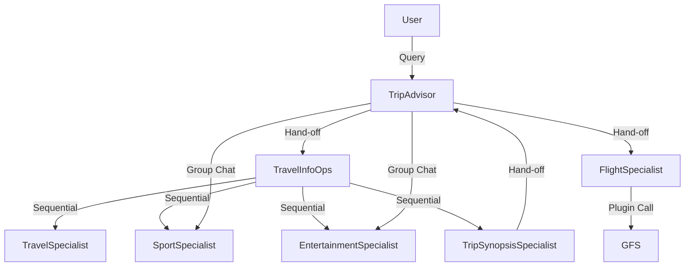

# Alvianda Travel – Agentic AI Architecture

## 🧭 Overview

**Alvianda Travel** is a virtual travel assistant platform that leverages **Semantic Kernel (SK)** and **Azure OpenAI** to deliver intelligent, modular, and orchestrated travel planning experiences. The system is composed of **six specialized AI agents**, each with a defined role, communication pattern, and orchestration strategy. These agents collaborate to fulfill user travel inquiries, from destination insights to flight booking options.

---

## 🧠 Core Technologies

- **Semantic Kernel (SK)**: Used to define and orchestrate agent behaviors using three orchestration patterns:
  - **Sequential Orchestration**
  - **Hand-off Orchestration**
  - **Group Chat Orchestration**
- **Azure OpenAI**: Powers the LLMs behind each agent, with prompt-engineered instructions to constrain their domain knowledge.
- **Google Flights Search (GFS)**: Accessed via plugin integration for real-time flight data.

---

## 🧱 System Architecture Overview

### 🔹 Platform Stack

- **LLM Provider**: Azure OpenAI (e.g., GPT-4)
- **Agent Framework**: Semantic Kernel (SK)
- **Plugin Integration**: REST-based plugin for Google Flights Search (GFS)
- **Hosting**: Azure Functions / Azure App Service
- **State Management**: Stateless agents with optional session memory via Azure Cosmos DB or Redis (future enhancement)

---

## 🧩 Agent Architecture

### 1. TripAdvisor Agent (User-Facing)

- **Role**: Entry point for user queries about destinations, events, and trip planning.
- **Function**: Acts as a triage agent, extracting user intent and initiating orchestration flows.
- **Orchestration**:
  - Hand-off Orchestration to TravelInfoOps proxy agent.
  - Group Chat Orchestration for follow-up queries involving event specialists.
- **Constraints**: Cannot answer directly using general LLM knowledge; must delegate.
- **Prompt Template**:
  - Extracts `intent`, `destination`, `date_range`, `query_type` from user input.

---

### 2. TravelInfoOps Agent (Internal Proxy)

- **Role**: Orchestrator for destination-related information.
- **Function**: Executes Sequential Orchestration of domain-specific agents:
  1. TravelSpecialist
  2. SportSpecialist
  3. EntertainmentSpecialist
  4. TripSynopsisSpecialist
- **Prompt Template**: "You are a travel orchestrator. Call each agent in sequence and compile their outputs."

---

### 3. TravelSpecialist / SportSpecialist / EntertainmentSpecialist

- **Type**: Internal domain experts
- **Prompt Constraints**:
  - Scoped to a single domain (travel, sports, entertainment)
  - Prompts include strict instructions: “Only respond with information relevant to [destination] within the next 3 months.”
- **LLM Usage**: No plugins; relies on LLM general knowledge filtered by prompt

---

### 4. TripSynopsisSpecialist Agent

- **Type**: Internal summarizer
- **Prompt Template**:
  - "You are a travel summary generator. Create a concise, engaging summary from the following inputs: [travel], [sports], [entertainment]."
- **Output**: Markdown or plain text summary for user display

---

### 5. FlightSpecialist Agent (User-Facing)

- **Role**: Provides flight options to the user’s destination.
- **Function**:
  - Extracts destination country using LLM
  - Maps to GFS-compatible parameters (e.g., IATA codes, date ranges)
  - Calls GFS plugin and returns structured JSON
- **Plugin Interface**:
  - REST API wrapper with authentication
  - Input: `{ origin, destination, date_range }`
  - Output: JSON array of flight options with deep links
- **Prompt Template**:
  - "You are a flight search expert. Use the plugin to find flights to [destination]. Return results in JSON format."

---

## 🔄 Orchestration Patterns

### 🔁 Sequential Orchestration

- **Used by**: TravelInfoOps
- **Purpose**: Linear execution of agents with dependent outputs
- **Flow**: TravelSpecialist → SportSpecialist → EntertainmentSpecialist → TripSynopsisSpecialist

### 🔀 Hand-off Orchestration

- **Used by**: TripAdvisor
- **Purpose**: Delegates task to a specialized agent based on intent
- **Examples**:
  - To TravelInfoOps for destination info
  - To FlightSpecialist for flight search

### 👥 Group Chat Orchestration

- **Used by**: TripAdvisor in follow-up queries
- **Purpose**: Parallel engagement of multiple agents
- **Example**: Simultaneous queries to SportSpecialist and EntertainmentSpecialist for event updates

---

## 📦 Plugin Integration: Google Flights Search (GFS)

- **Plugin Wrapper**: Implemented as a Semantic Kernel plugin
- **Security**: API key stored in Azure Key Vault
- **Mapping Logic**:
  - LLM extracts country → maps to IATA airport codes
  - Constructs GFS query parameters
- **Response Handling**:
  - JSON parsing and formatting for user display
  - Includes flight times, prices, and booking links

---

## 🧩 Agent Orchestrations

---

## 🧪 Testing & Monitoring

- **Unit Testing**: Each agent tested with mock prompts and expected outputs
- **Integration Testing**: Orchestration flows validated end-to-end
- **Monitoring**:
  - Azure Application Insights for telemetry
  - Logging of orchestration paths and plugin calls

---

## 📈 Scalability & Extensibility

- **Modular Agent Design**: New agents (e.g., HotelSpecialist, VisaAdvisor) can be added with minimal changes
- **Multi-turn Memory**: Future enhancement using SK memory store
- **Personalization**: User profiles and preferences stored in Cosmos DB
