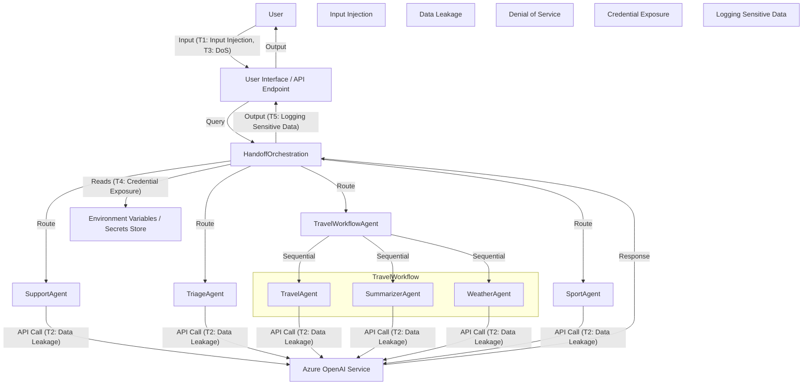

## Threat Model for Multi-Agent Embedded Orchestration

### 1. **Architecture Overview**
- The system orchestrates multiple AI agents (SupportAgent, TriageAgent, TravelWorkflowAgent, SportAgent) using Azure OpenAI services.
- User queries are routed through a handoff orchestration, with some agents (like TravelWorkflowAgent) running their own internal sequential orchestration (TravelAgent, SummarizerAgent, WeatherAgent).
- The system relies on environment variables for Azure OpenAI credentials and endpoints.
- The agents and orchestrations are all implemented in a single script agentic_embed_orch.py

### 2. **Assets**
- Azure OpenAI API keys and endpoints
- User input data (potentially sensitive)
- Agent-generated responses (may contain sensitive or confidential information)
- Orchestration logic and agent instructions

### 3. **Potential Threats**

#### a. **Credential Exposure**
- **Threat:** Azure OpenAI API keys and endpoints are loaded from environment variables. If these are leaked (e.g., via logs, error messages, or misconfiguration), attackers could abuse the API.
- **Mitigation:** Ensure environment variables are never logged or exposed. Use secure storage for secrets (e.g., Azure Key Vault).

#### b. **Input Injection**
- **Threat:** User input is passed directly to agents and may be used in prompts. Malicious input could manipulate agent behavior or cause prompt injection attacks.
- **Mitigation:** Sanitize and validate user input. Use prompt engineering best practices to minimize prompt injection risk.

#### c. **Denial of Service (DoS)**
- **Threat:** Attackers could flood the system with requests, exhausting API quotas or causing service degradation.
- **Mitigation:** Implement rate limiting, input validation, and monitoring for abnormal usage patterns.

#### d. **Data Leakage**
- **Threat:** Agents may inadvertently return sensitive information if not properly scoped or if prompt context is not managed securely.
- **Mitigation:** Carefully design agent instructions to avoid leaking internal or sensitive data. Monitor outputs for compliance.

#### e. **Unauthorized Access**
- **Threat:** If the orchestration is exposed as a public service, unauthorized users could access the system and its capabilities.
- **Mitigation:** Implement authentication and authorization controls for any public endpoints.

#### f. **Agent Misrouting**
- **Threat:** Logic errors in handoff or orchestration could route sensitive queries to the wrong agent, leading to inappropriate responses or data exposure.
- **Mitigation:** Test routing logic thoroughly and add logging/monitoring for unexpected agent handoffs.

#### g. **Service Misconfiguration**
- **Threat:** Incorrect configuration of Azure OpenAI services (e.g., wrong endpoint, insufficient permissions) could lead to service outages or security gaps.
- **Mitigation:** Validate configuration at startup and handle errors gracefully.

#### h. **Logging Sensitive Data**
- **Threat:** The system prints agent messages and responses, which may include sensitive user data.
- **Mitigation:** Avoid logging sensitive information or redact logs as needed.

### 4. **Trust Boundaries**
- Between user input and agent orchestration logic
- Between orchestration logic and Azure OpenAI service
- Between internal agent orchestration (e.g., TravelWorkflowAgent) and main orchestration

### 5. **Recommendations**
- Use secure secret management for API keys.
- Sanitize and validate all user inputs.
- Limit and monitor API usage.
- Implement authentication for any user-facing endpoints.
- Regularly review and update agent instructions to prevent data leakage.
- Avoid logging sensitive data.
- Monitor for abnormal behavior and errors.

---

### 6. **Threat Model Diagram**

